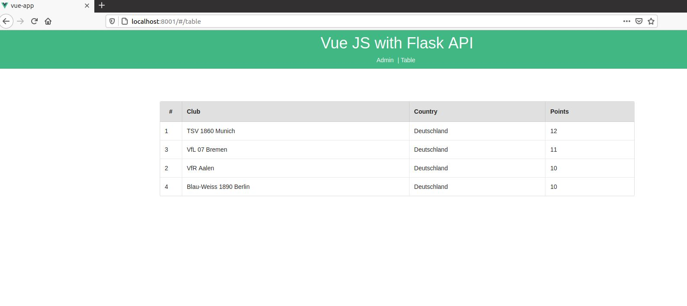
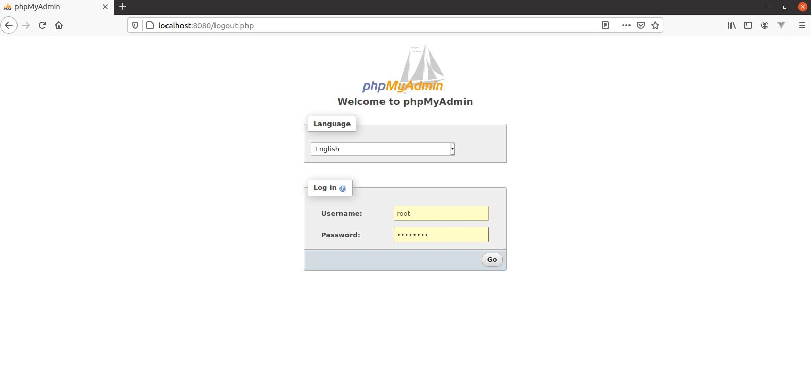
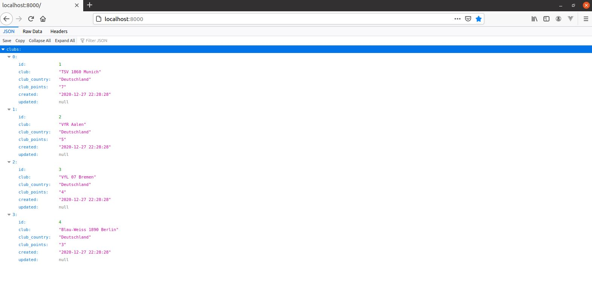

# Web Application 

This project can be used to run a basic [flask app with MySQL as DB]- BACKEND and VUE.js - [FRONTEND]  using docker-compose.

# Description
The "Table" view I see a table with football clubs, sorted by points.
In the "Admin" view I have the possibility to enter a result:
Two clubs can be selected and one can be marked as winner. Each victory is worth three points. If no winner is marked, the match is considered a draw and both teams get one point. Goals are not counted.

## Getting Started

**Step 1:** Make sure git is installed on your os. I will be using Ubuntu 20.04.1  for the project in VM.

**Step 2:** Clone the project into your local machine using below command.

```git clone https://github.com/willycamps/Vue-Flask-Webapp.git```

### Prerequisites

**1. Docker**

Make sure you have Docker installed. Please follow the below link for official documentation from Docker to install latest version of docker on your os. For this project I am using Docker CE (18.09).

```https://docs.docker.com/docker-for-mac/install/```

### Installing

**Step 1:** Change to the directory where the project was cloned in previous step.

```
cd flask-vue-mysql-docker
```

**Step 2:** Make sure Docker is up and running. You can start the docker engine from command line.

```
sudo docker info
```

**Step 3:** Run

```
docker-compose up --build
```

Build and run in the background and view logs for all the instances :
```
docker-compose up --build -d && docker-compose logs --tail=all -f
```
**Step 4:** Open up the browser

* [The Front-End with Vue.js] (http://localhost:8001/) - Vue.js 
```
http://localhost:8001/
```


* [PhpMyAdmin] (http://localhost:8080/) - MySQL Client
```
http://localhost:8080/
```


* [The API] (http://localhost:8000/) - API
```
http://localhost:8000/
```



## Deployment

## Built With

* [Docker](https://docs.docker.com/compose/install/) -  Docker
* [Flask](https://flask.palletsprojects.com/en/1.1.x/quickstart/) - The web framework
* [Python](https://www.python.org/) - Programming language
* [pip](https://pip.pypa.io/en/stable/) - Package and dependency manager
* [MySQL](https://www.mysql.com/) - Database
* [PhpMyAdmin](https://www.phpmyadmin.net/) - MySql Client

## Versioning
* GIT
## Authors
* Willy E. Campos
## TODO
* Add README together 
* Unit Test
* CI/CD
* Boostrap CSS
* AWS / Google-Cloud
## Change Log
* v0.2 - Integrate Authentication.
* v0.1 - Initial release.

